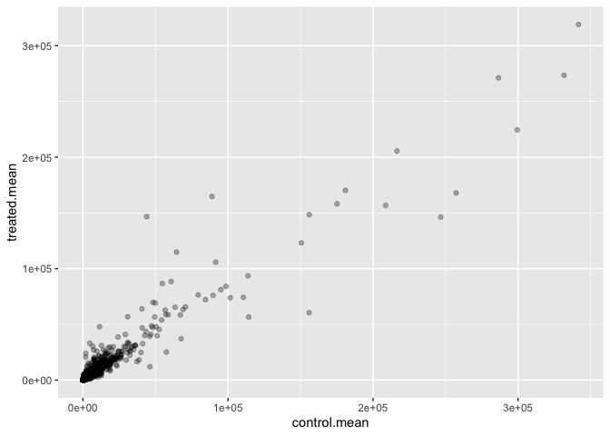
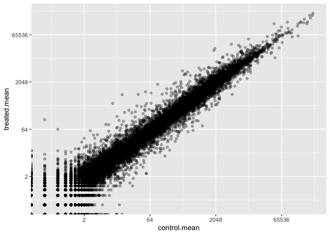
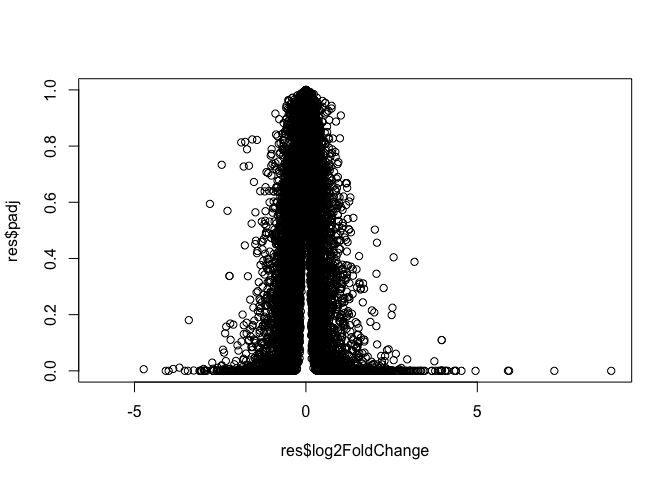
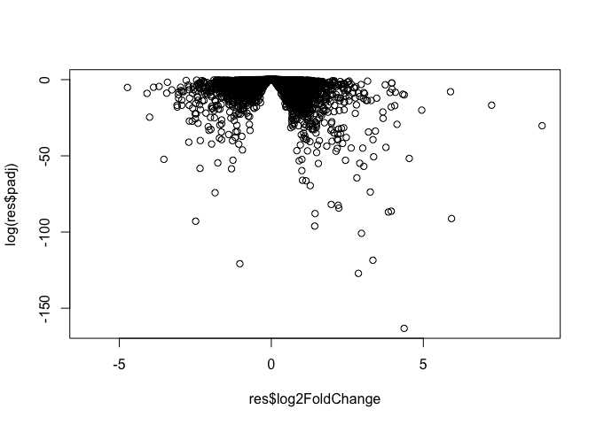
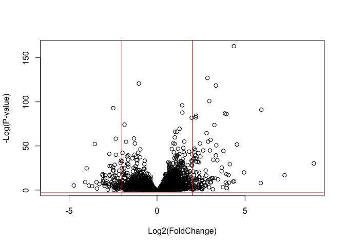
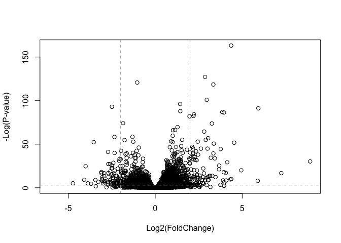
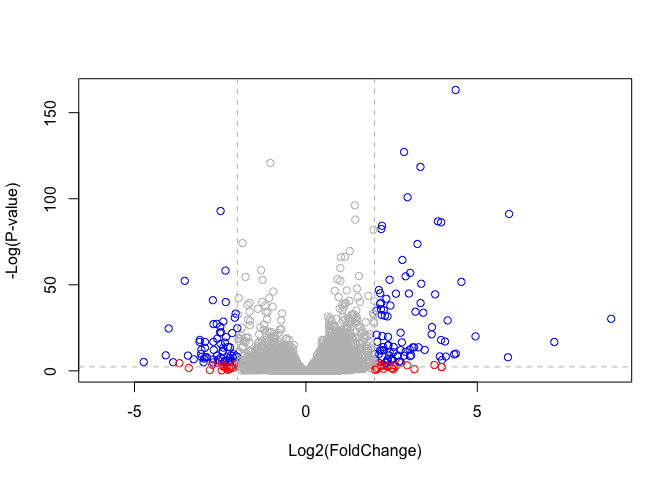

Class12
================
Yuting Shen

``` r
library(BiocManager)
```

    Bioconductor version '3.15' is out-of-date; the current release version '3.16'
      is available with R version '4.2'; see https://bioconductor.org/install

``` r
library(DESeq2)
```

    Loading required package: S4Vectors

    Loading required package: stats4

    Loading required package: BiocGenerics


    Attaching package: 'BiocGenerics'

    The following objects are masked from 'package:stats':

        IQR, mad, sd, var, xtabs

    The following objects are masked from 'package:base':

        anyDuplicated, append, as.data.frame, basename, cbind, colnames,
        dirname, do.call, duplicated, eval, evalq, Filter, Find, get, grep,
        grepl, intersect, is.unsorted, lapply, Map, mapply, match, mget,
        order, paste, pmax, pmax.int, pmin, pmin.int, Position, rank,
        rbind, Reduce, rownames, sapply, setdiff, sort, table, tapply,
        union, unique, unsplit, which.max, which.min


    Attaching package: 'S4Vectors'

    The following objects are masked from 'package:base':

        expand.grid, I, unname

    Loading required package: IRanges

    Loading required package: GenomicRanges

    Loading required package: GenomeInfoDb

    Loading required package: SummarizedExperiment

    Loading required package: MatrixGenerics

    Loading required package: matrixStats


    Attaching package: 'MatrixGenerics'

    The following objects are masked from 'package:matrixStats':

        colAlls, colAnyNAs, colAnys, colAvgsPerRowSet, colCollapse,
        colCounts, colCummaxs, colCummins, colCumprods, colCumsums,
        colDiffs, colIQRDiffs, colIQRs, colLogSumExps, colMadDiffs,
        colMads, colMaxs, colMeans2, colMedians, colMins, colOrderStats,
        colProds, colQuantiles, colRanges, colRanks, colSdDiffs, colSds,
        colSums2, colTabulates, colVarDiffs, colVars, colWeightedMads,
        colWeightedMeans, colWeightedMedians, colWeightedSds,
        colWeightedVars, rowAlls, rowAnyNAs, rowAnys, rowAvgsPerColSet,
        rowCollapse, rowCounts, rowCummaxs, rowCummins, rowCumprods,
        rowCumsums, rowDiffs, rowIQRDiffs, rowIQRs, rowLogSumExps,
        rowMadDiffs, rowMads, rowMaxs, rowMeans2, rowMedians, rowMins,
        rowOrderStats, rowProds, rowQuantiles, rowRanges, rowRanks,
        rowSdDiffs, rowSds, rowSums2, rowTabulates, rowVarDiffs, rowVars,
        rowWeightedMads, rowWeightedMeans, rowWeightedMedians,
        rowWeightedSds, rowWeightedVars

    Loading required package: Biobase

    Welcome to Bioconductor

        Vignettes contain introductory material; view with
        'browseVignettes()'. To cite Bioconductor, see
        'citation("Biobase")', and for packages 'citation("pkgname")'.


    Attaching package: 'Biobase'

    The following object is masked from 'package:MatrixGenerics':

        rowMedians

    The following objects are masked from 'package:matrixStats':

        anyMissing, rowMedians

## 2. Import countData and colData

We will use good old`read.cvs()` to read the two things we need for this
analysis:

-count data -col data (metadata)

``` r
counts <- read.csv("airway_scaledcounts.csv", row.names=1)
metadata <-  read.csv("airway_metadata.csv")
```

Let’s look at the `counts` data and `metadata` data.

``` r
head(counts)
```

                    SRR1039508 SRR1039509 SRR1039512 SRR1039513 SRR1039516
    ENSG00000000003        723        486        904        445       1170
    ENSG00000000005          0          0          0          0          0
    ENSG00000000419        467        523        616        371        582
    ENSG00000000457        347        258        364        237        318
    ENSG00000000460         96         81         73         66        118
    ENSG00000000938          0          0          1          0          2
                    SRR1039517 SRR1039520 SRR1039521
    ENSG00000000003       1097        806        604
    ENSG00000000005          0          0          0
    ENSG00000000419        781        417        509
    ENSG00000000457        447        330        324
    ENSG00000000460         94        102         74
    ENSG00000000938          0          0          0

``` r
head(metadata)
```

              id     dex celltype     geo_id
    1 SRR1039508 control   N61311 GSM1275862
    2 SRR1039509 treated   N61311 GSM1275863
    3 SRR1039512 control  N052611 GSM1275866
    4 SRR1039513 treated  N052611 GSM1275867
    5 SRR1039516 control  N080611 GSM1275870
    6 SRR1039517 treated  N080611 GSM1275871

> Q1. How many genes are in this dataset?

38694

``` r
nrow(counts)
```

    [1] 38694

First we should check the correspondence of the matadata and count data

``` r
metadata$id
```

    [1] "SRR1039508" "SRR1039509" "SRR1039512" "SRR1039513" "SRR1039516"
    [6] "SRR1039517" "SRR1039520" "SRR1039521"

``` r
colnames(counts)
```

    [1] "SRR1039508" "SRR1039509" "SRR1039512" "SRR1039513" "SRR1039516"
    [6] "SRR1039517" "SRR1039520" "SRR1039521"

To check that these are all in the same order we can use `==` test of
equality.

``` r
all(metadata$id == colnames(counts))
```

    [1] TRUE

> Q2. How many ‘control’ cell lines do we have?

4

## 3. Toy differential gene expression (analysis via comparasion of CONTROL vs TREATED)

Look at the metadata object again to see which samples are control and
which are drug treated. You can also see this in the metadata printed
table below:

``` r
control <- metadata[metadata[,"dex"]=="control",]
control.counts <- counts[ ,control$id]
control.mean <- rowSums( control.counts )/4 
head(control.mean)
```

    ENSG00000000003 ENSG00000000005 ENSG00000000419 ENSG00000000457 ENSG00000000460 
             900.75            0.00          520.50          339.75           97.25 
    ENSG00000000938 
               0.75 

``` r
library(dplyr)
```


    Attaching package: 'dplyr'

    The following object is masked from 'package:Biobase':

        combine

    The following object is masked from 'package:matrixStats':

        count

    The following objects are masked from 'package:GenomicRanges':

        intersect, setdiff, union

    The following object is masked from 'package:GenomeInfoDb':

        intersect

    The following objects are masked from 'package:IRanges':

        collapse, desc, intersect, setdiff, slice, union

    The following objects are masked from 'package:S4Vectors':

        first, intersect, rename, setdiff, setequal, union

    The following objects are masked from 'package:BiocGenerics':

        combine, intersect, setdiff, union

    The following objects are masked from 'package:stats':

        filter, lag

    The following objects are masked from 'package:base':

        intersect, setdiff, setequal, union

``` r
control <- metadata %>% filter(dex=="control")
control.counts <- counts %>% select(control$id) 
control.mean <- rowSums(control.counts)/4
head(control.mean)
```

    ENSG00000000003 ENSG00000000005 ENSG00000000419 ENSG00000000457 ENSG00000000460 
             900.75            0.00          520.50          339.75           97.25 
    ENSG00000000938 
               0.75 

> Q3. How would you make the above code in either approach more robust?

The “treated” have the dex drug and the “control” do not. First I need
to be abale to extract just the “control” columns in the `counts` data
set.

``` r
control.inds <- metadata$dex == "control"
control <- metadata[control.inds,]
control$id
```

    [1] "SRR1039508" "SRR1039512" "SRR1039516" "SRR1039520"

Now I can use this to acess just the”control” columns of my `counts`
data…

``` r
control.counts <- counts[,control$id]
head(control.counts)
```

                    SRR1039508 SRR1039512 SRR1039516 SRR1039520
    ENSG00000000003        723        904       1170        806
    ENSG00000000005          0          0          0          0
    ENSG00000000419        467        616        582        417
    ENSG00000000457        347        364        318        330
    ENSG00000000460         96         73        118        102
    ENSG00000000938          0          1          2          0

Find the mean count value for each transcript/gene by binding the
`rowMeans()`.

``` r
control.mean <- rowMeans(control.counts)
head(control.mean)
```

    ENSG00000000003 ENSG00000000005 ENSG00000000419 ENSG00000000457 ENSG00000000460 
             900.75            0.00          520.50          339.75           97.25 
    ENSG00000000938 
               0.75 

> Q4. Follow the same procedure for the treated samples (i.e. calculate
> the mean per gene across drug treated samples and assign to a labeled
> vector called treated.mean)

``` r
treated.id <- metadata[metadata$dex =="treated","id"]
treated.mean <- rowMeans(counts[,treated.id])
head(treated.mean)
```

    ENSG00000000003 ENSG00000000005 ENSG00000000419 ENSG00000000457 ENSG00000000460 
             658.00            0.00          546.00          316.50           78.75 
    ENSG00000000938 
               0.00 

We will combine our meancount data for bookkeeping purposes.

``` r
meancounts <- data.frame(control.mean, treated.mean)
```

Let’s do a quick plot to see how our data looks

> Q5 (a). Create a scatter plot showing the mean of the treated samples
> against the mean of the control samples. Your plot should look
> something like the following.

``` r
plot(meancounts)
```


> Q5 (b).You could also use the ggplot2 package to make this figure
> producing the plot below. What geom\_?() function would you use for
> this plot?

``` r
library(ggplot2)
ggplot(meancounts, aes(control.mean, treated.mean))+
  geom_point(alpha = 0.3)
```



> Q6. Try plotting both axes on a log scale. What is the argument to
> plot() that allows you to do this?

``` r
library(ggplot2)
ggplot(meancounts, aes(control.mean, treated.mean))+
  scale_x_continuous(trans="log2")+
  scale_y_continuous(trans="log2")+
  geom_point(alpha = 0.3)
```

    Warning: Transformation introduced infinite values in continuous x-axis

    Warning: Transformation introduced infinite values in continuous y-axis



This is very heavely skewed and over a wide range-calling out for a long
transform?

``` r
plot(meancounts, log="xy")
```

    Warning in xy.coords(x, y, xlabel, ylabel, log): 15032 x values <= 0 omitted
    from logarithmic plot

    Warning in xy.coords(x, y, xlabel, ylabel, log): 15281 y values <= 0 omitted
    from logarithmic plot


We like working with log tranformed dataa as it can help make things
more straight forward to interpret.

If we have no change:

``` r
log2(20/20)
```

    [1] 0

What about if we had a doubling

``` r
log2(40/20)
```

    [1] 1

``` r
log2(10/20)
```

    [1] -1

``` r
log2(80/20)
```

    [1] 2

we like working with log2 fold-change values. Let’s calcuate them for
our data.

``` r
meancounts$log2fc <-log2(meancounts$treated.mean/meancounts$control.mean)
head(meancounts)
```

                    control.mean treated.mean      log2fc
    ENSG00000000003       900.75       658.00 -0.45303916
    ENSG00000000005         0.00         0.00         NaN
    ENSG00000000419       520.50       546.00  0.06900279
    ENSG00000000457       339.75       316.50 -0.10226805
    ENSG00000000460        97.25        78.75 -0.30441833
    ENSG00000000938         0.75         0.00        -Inf

> Q7. What is the purpose of the arr.ind argument in the which()
> function call above? Why would we then take the first column of the
> output and need to call the unique() function?

``` r
zero.vals <- which(meancounts[,1:2]==0, arr.ind=TRUE)

to.rm <- unique(zero.vals[,1])
mycounts <- meancounts[-to.rm,]
head(mycounts)
```

                    control.mean treated.mean      log2fc
    ENSG00000000003       900.75       658.00 -0.45303916
    ENSG00000000419       520.50       546.00  0.06900279
    ENSG00000000457       339.75       316.50 -0.10226805
    ENSG00000000460        97.25        78.75 -0.30441833
    ENSG00000000971      5219.00      6687.50  0.35769358
    ENSG00000001036      2327.00      1785.75 -0.38194109

The arr.ind=TRUE argument will clause which() to return both the row and
column indices (i.e. positions) where there are TRUE values. In this
case this will tell us which genes (rows) and samples (columns) have
zero counts. We are going to ignore any genes that have zero counts in
any sample so we just focus on the row answer. Calling unique() will
ensure we dont count any row twice if it has zer entries in both
samples.

We want filter out any genes(that is the rows) where we have ZERO count
data.

``` r
to.keep.inds <- rowSums(meancounts[,1:2]==0) == 0
```

``` r
mycounts <- meancounts[to.keep.inds,]
nrow(mycounts)
```

    [1] 21817

> Q8. Using the up.ind vector above can you determine how many up
> regulated genes we have at the greater than 2 fc level?

A common threshold for calling genes as differentially expressed is a
log2 fold-change of +2 and -2.

``` r
up.ind <- mycounts$log2fc > 2
sum(up.ind)
```

    [1] 250

``` r
sum(mycounts$log2fc >= +2)
```

    [1] 314

> Q9. Using the down.ind vector above can you determine how many down
> regulated genes we have at the greater than 2 fc level? What percent
> is this?

``` r
down.ind <- mycounts$log2fc < -2
sum(down.ind)
```

    [1] 367

367 \> Q10. Do you trust these results? Why or why not?

No, since all our analysis has been done based on fold change. However,
fold change can be large (e.g. \>\>two-fold up- or down-regulation)
without being statistically significant (e.g. based on p-values). We
have not done anything yet to determine whether the differences we are
seeing are significant.

``` r
round((sum(mycounts$log2fc >= +2)/nrow(mycounts))*100,2)
```

    [1] 1.44

and down regulated:

``` r
round((sum(mycounts$log2fc <= -2)/nrow(mycounts))*100,2)
```

    [1] 2.22

We need some stats to check if the drug induced difference is signifi
cant! \## DESeq2 analysis

``` r
library(DESeq2)
citation("DESeq2")
```


    To cite package 'DESeq2' in publications use:

      Love, M.I., Huber, W., Anders, S. Moderated estimation of fold change
      and dispersion for RNA-seq data with DESeq2 Genome Biology 15(12):550
      (2014)

    A BibTeX entry for LaTeX users is

      @Article{,
        title = {Moderated estimation of fold change and dispersion for RNA-seq data with DESeq2},
        author = {Michael I. Love and Wolfgang Huber and Simon Anders},
        year = {2014},
        journal = {Genome Biology},
        doi = {10.1186/s13059-014-0550-8},
        volume = {15},
        issue = {12},
        pages = {550},
      }

``` r
dds <- DESeqDataSetFromMatrix(countData=counts, 
                              colData=metadata, 
                              design=~dex)
```

    converting counts to integer mode

    Warning in DESeqDataSet(se, design = design, ignoreRank): some variables in
    design formula are characters, converting to factors

``` r
dds
```

    class: DESeqDataSet 
    dim: 38694 8 
    metadata(1): version
    assays(1): counts
    rownames(38694): ENSG00000000003 ENSG00000000005 ... ENSG00000283120
      ENSG00000283123
    rowData names(0):
    colnames(8): SRR1039508 SRR1039509 ... SRR1039520 SRR1039521
    colData names(4): id dex celltype geo_id

## DESeq analysis

``` r
dds <- DESeq(dds)
```

    estimating size factors

    estimating dispersions

    gene-wise dispersion estimates

    mean-dispersion relationship

    final dispersion estimates

    fitting model and testing

``` r
res <- results(dds)
res
```

    log2 fold change (MLE): dex treated vs control 
    Wald test p-value: dex treated vs control 
    DataFrame with 38694 rows and 6 columns
                     baseMean log2FoldChange     lfcSE      stat    pvalue
                    <numeric>      <numeric> <numeric> <numeric> <numeric>
    ENSG00000000003  747.1942     -0.3507030  0.168246 -2.084470 0.0371175
    ENSG00000000005    0.0000             NA        NA        NA        NA
    ENSG00000000419  520.1342      0.2061078  0.101059  2.039475 0.0414026
    ENSG00000000457  322.6648      0.0245269  0.145145  0.168982 0.8658106
    ENSG00000000460   87.6826     -0.1471420  0.257007 -0.572521 0.5669691
    ...                   ...            ...       ...       ...       ...
    ENSG00000283115  0.000000             NA        NA        NA        NA
    ENSG00000283116  0.000000             NA        NA        NA        NA
    ENSG00000283119  0.000000             NA        NA        NA        NA
    ENSG00000283120  0.974916      -0.668258   1.69456 -0.394354  0.693319
    ENSG00000283123  0.000000             NA        NA        NA        NA
                         padj
                    <numeric>
    ENSG00000000003  0.163035
    ENSG00000000005        NA
    ENSG00000000419  0.176032
    ENSG00000000457  0.961694
    ENSG00000000460  0.815849
    ...                   ...
    ENSG00000283115        NA
    ENSG00000283116        NA
    ENSG00000283119        NA
    ENSG00000283120        NA
    ENSG00000283123        NA

``` r
summary(res)
```


    out of 25258 with nonzero total read count
    adjusted p-value < 0.1
    LFC > 0 (up)       : 1563, 6.2%
    LFC < 0 (down)     : 1188, 4.7%
    outliers [1]       : 142, 0.56%
    low counts [2]     : 9971, 39%
    (mean count < 10)
    [1] see 'cooksCutoff' argument of ?results
    [2] see 'independentFiltering' argument of ?results

``` r
res05 <- results(dds, alpha=0.05)
summary(res05)
```


    out of 25258 with nonzero total read count
    adjusted p-value < 0.05
    LFC > 0 (up)       : 1236, 4.9%
    LFC < 0 (down)     : 933, 3.7%
    outliers [1]       : 142, 0.56%
    low counts [2]     : 9033, 36%
    (mean count < 6)
    [1] see 'cooksCutoff' argument of ?results
    [2] see 'independentFiltering' argument of ?results

# Turn to DESeq2

Let’s turn to doing this the correct way with the DESeq2 package.m

``` r
library(DESeq2)
```

The main function in the DESeq2 package is called `deseq()`. It wants
our count data and our colData(metadata) as input in a specific way.

``` r
dds <- DESeqDataSetFromMatrix(countData = counts,
                       colData = metadata,
                       design=~dex)
```

    converting counts to integer mode

    Warning in DESeqDataSet(se, design = design, ignoreRank): some variables in
    design formula are characters, converting to factors

``` r
dds <- DESeq(dds)
```

    estimating size factors

    estimating dispersions

    gene-wise dispersion estimates

    mean-dispersion relationship

    final dispersion estimates

    fitting model and testing

``` r
results(dds)
```

    log2 fold change (MLE): dex treated vs control 
    Wald test p-value: dex treated vs control 
    DataFrame with 38694 rows and 6 columns
                     baseMean log2FoldChange     lfcSE      stat    pvalue
                    <numeric>      <numeric> <numeric> <numeric> <numeric>
    ENSG00000000003  747.1942     -0.3507030  0.168246 -2.084470 0.0371175
    ENSG00000000005    0.0000             NA        NA        NA        NA
    ENSG00000000419  520.1342      0.2061078  0.101059  2.039475 0.0414026
    ENSG00000000457  322.6648      0.0245269  0.145145  0.168982 0.8658106
    ENSG00000000460   87.6826     -0.1471420  0.257007 -0.572521 0.5669691
    ...                   ...            ...       ...       ...       ...
    ENSG00000283115  0.000000             NA        NA        NA        NA
    ENSG00000283116  0.000000             NA        NA        NA        NA
    ENSG00000283119  0.000000             NA        NA        NA        NA
    ENSG00000283120  0.974916      -0.668258   1.69456 -0.394354  0.693319
    ENSG00000283123  0.000000             NA        NA        NA        NA
                         padj
                    <numeric>
    ENSG00000000003  0.163035
    ENSG00000000005        NA
    ENSG00000000419  0.176032
    ENSG00000000457  0.961694
    ENSG00000000460  0.815849
    ...                   ...
    ENSG00000283115        NA
    ENSG00000283116        NA
    ENSG00000283119        NA
    ENSG00000283120        NA
    ENSG00000283123        NA

Now what we have get so far is the log2 fold-change and the adjusted
p-value for the significance.

``` r
res <- results(dds)
head(res)
```

    log2 fold change (MLE): dex treated vs control 
    Wald test p-value: dex treated vs control 
    DataFrame with 6 rows and 6 columns
                      baseMean log2FoldChange     lfcSE      stat    pvalue
                     <numeric>      <numeric> <numeric> <numeric> <numeric>
    ENSG00000000003 747.194195     -0.3507030  0.168246 -2.084470 0.0371175
    ENSG00000000005   0.000000             NA        NA        NA        NA
    ENSG00000000419 520.134160      0.2061078  0.101059  2.039475 0.0414026
    ENSG00000000457 322.664844      0.0245269  0.145145  0.168982 0.8658106
    ENSG00000000460  87.682625     -0.1471420  0.257007 -0.572521 0.5669691
    ENSG00000000938   0.319167     -1.7322890  3.493601 -0.495846 0.6200029
                         padj
                    <numeric>
    ENSG00000000003  0.163035
    ENSG00000000005        NA
    ENSG00000000419  0.176032
    ENSG00000000457  0.961694
    ENSG00000000460  0.815849
    ENSG00000000938        NA

A first plot

``` r
plot(res$log2FoldChange, res$padj)
```



Well that plot sucked all the interesting P-values are down below zero.
I am going to take the log of the p-value

``` r
plot(res$log2FoldChange, log(res$padj))
```



We can flip the y-axis so the plot does not look “upside down”

``` r
plot(res$log2FoldChange, -log(res$padj), xlab="Log2(FoldChange)",
      ylab="-Log(P-value)")
abline(v=c(-2,+2),col="red")
abline(h=log(0.05), col="red")
```



``` r
plot( res$log2FoldChange,  -log(res$padj), 
      xlab="Log2(FoldChange)",
      ylab="-Log(P-value)")
```


``` r
plot( res$log2FoldChange,  -log(res$padj), 
 ylab="-Log(P-value)", xlab="Log2(FoldChange)")

# Add some cut-off lines
abline(v=c(-2,2), col="darkgray", lty=2)
abline(h=-log(0.05), col="darkgray", lty=2)
```



``` r
# Setup our custom point color vector 
mycols <- rep("gray", nrow(res))
mycols[ abs(res$log2FoldChange) > 2 ]  <- "red" 

inds <- (res$padj < 0.01) & (abs(res$log2FoldChange) > 2 )
mycols[ inds ] <- "blue"

# Volcano plot with custom colors 
plot( res$log2FoldChange,  -log(res$padj), 
 col=mycols, ylab="-Log(P-value)", xlab="Log2(FoldChange)" )

# Cut-off lines
abline(v=c(-2,2), col="gray", lty=2)
abline(h=-log(0.1), col="gray", lty=2)
```



## Anotation of our gene set results

I will start by loading two Annotation packages from bioconductor:

``` r
library("AnnotationDbi")
```


    Attaching package: 'AnnotationDbi'

    The following object is masked from 'package:dplyr':

        select

``` r
library("org.Hs.eg.db")
```

The `mapIDs()` function “maps” database identifiers between different
databases. In other words it translates the identifiers used by one
database to that used by another database.

``` r
columns(org.Hs.eg.db)
```

     [1] "ACCNUM"       "ALIAS"        "ENSEMBL"      "ENSEMBLPROT"  "ENSEMBLTRANS"
     [6] "ENTREZID"     "ENZYME"       "EVIDENCE"     "EVIDENCEALL"  "GENENAME"    
    [11] "GENETYPE"     "GO"           "GOALL"        "IPI"          "MAP"         
    [16] "OMIM"         "ONTOLOGY"     "ONTOLOGYALL"  "PATH"         "PFAM"        
    [21] "PMID"         "PROSITE"      "REFSEQ"       "SYMBOL"       "UCSCKG"      
    [26] "UNIPROT"     

my result are in the object `res`

``` r
head(res)
```

    log2 fold change (MLE): dex treated vs control 
    Wald test p-value: dex treated vs control 
    DataFrame with 6 rows and 6 columns
                      baseMean log2FoldChange     lfcSE      stat    pvalue
                     <numeric>      <numeric> <numeric> <numeric> <numeric>
    ENSG00000000003 747.194195     -0.3507030  0.168246 -2.084470 0.0371175
    ENSG00000000005   0.000000             NA        NA        NA        NA
    ENSG00000000419 520.134160      0.2061078  0.101059  2.039475 0.0414026
    ENSG00000000457 322.664844      0.0245269  0.145145  0.168982 0.8658106
    ENSG00000000460  87.682625     -0.1471420  0.257007 -0.572521 0.5669691
    ENSG00000000938   0.319167     -1.7322890  3.493601 -0.495846 0.6200029
                         padj
                    <numeric>
    ENSG00000000003  0.163035
    ENSG00000000005        NA
    ENSG00000000419  0.176032
    ENSG00000000457  0.961694
    ENSG00000000460  0.815849
    ENSG00000000938        NA

``` r
res$symbol <- mapIds(org.Hs.eg.db,
                     keys=row.names(res), # Our gene names
                     keytype="ENSEMBL",  # The format of our gene names
                     column="SYMBOL",  # The new format we want to add
                     multiVals="first")
```

    'select()' returned 1:many mapping between keys and columns

``` r
head(res)
```

    log2 fold change (MLE): dex treated vs control 
    Wald test p-value: dex treated vs control 
    DataFrame with 6 rows and 7 columns
                      baseMean log2FoldChange     lfcSE      stat    pvalue
                     <numeric>      <numeric> <numeric> <numeric> <numeric>
    ENSG00000000003 747.194195     -0.3507030  0.168246 -2.084470 0.0371175
    ENSG00000000005   0.000000             NA        NA        NA        NA
    ENSG00000000419 520.134160      0.2061078  0.101059  2.039475 0.0414026
    ENSG00000000457 322.664844      0.0245269  0.145145  0.168982 0.8658106
    ENSG00000000460  87.682625     -0.1471420  0.257007 -0.572521 0.5669691
    ENSG00000000938   0.319167     -1.7322890  3.493601 -0.495846 0.6200029
                         padj      symbol
                    <numeric> <character>
    ENSG00000000003  0.163035      TSPAN6
    ENSG00000000005        NA        TNMD
    ENSG00000000419  0.176032        DPM1
    ENSG00000000457  0.961694       SCYL3
    ENSG00000000460  0.815849    C1orf112
    ENSG00000000938        NA         FGR

``` r
res$entrez <- mapIds(org.Hs.eg.db,
                     keys=row.names(res),
                     column="ENTREZID",
                     keytype="ENSEMBL",
                     multiVals="first")
```

    'select()' returned 1:many mapping between keys and columns

``` r
res$uniprot <- mapIds(org.Hs.eg.db,
                     keys=row.names(res),
                     column="UNIPROT",
                     keytype="ENSEMBL",
                     multiVals="first")
```

    'select()' returned 1:many mapping between keys and columns

``` r
res$genename <- mapIds(org.Hs.eg.db,
                     keys=row.names(res),
                     column="GENENAME",
                     keytype="ENSEMBL",
                     multiVals="first")
```

    'select()' returned 1:many mapping between keys and columns

``` r
head(res)
```

    log2 fold change (MLE): dex treated vs control 
    Wald test p-value: dex treated vs control 
    DataFrame with 6 rows and 10 columns
                      baseMean log2FoldChange     lfcSE      stat    pvalue
                     <numeric>      <numeric> <numeric> <numeric> <numeric>
    ENSG00000000003 747.194195     -0.3507030  0.168246 -2.084470 0.0371175
    ENSG00000000005   0.000000             NA        NA        NA        NA
    ENSG00000000419 520.134160      0.2061078  0.101059  2.039475 0.0414026
    ENSG00000000457 322.664844      0.0245269  0.145145  0.168982 0.8658106
    ENSG00000000460  87.682625     -0.1471420  0.257007 -0.572521 0.5669691
    ENSG00000000938   0.319167     -1.7322890  3.493601 -0.495846 0.6200029
                         padj      symbol      entrez     uniprot
                    <numeric> <character> <character> <character>
    ENSG00000000003  0.163035      TSPAN6        7105  A0A024RCI0
    ENSG00000000005        NA        TNMD       64102      Q9H2S6
    ENSG00000000419  0.176032        DPM1        8813      O60762
    ENSG00000000457  0.961694       SCYL3       57147      Q8IZE3
    ENSG00000000460  0.815849    C1orf112       55732  A0A024R922
    ENSG00000000938        NA         FGR        2268      P09769
                                  genename
                               <character>
    ENSG00000000003          tetraspanin 6
    ENSG00000000005            tenomodulin
    ENSG00000000419 dolichyl-phosphate m..
    ENSG00000000457 SCY1 like pseudokina..
    ENSG00000000460 chromosome 1 open re..
    ENSG00000000938 FGR proto-oncogene, ..

## Pathway Analysis

Pathway analysis (also known as gene set analysis or over-representation
analysis), aims to reduce the complexity of interpreting gene lists via
mapping the listed genes to known (i.e. annotated) biological pathways,
processes and functions.

``` r
library(pathview)
```

    ##############################################################################
    Pathview is an open source software package distributed under GNU General
    Public License version 3 (GPLv3). Details of GPLv3 is available at
    http://www.gnu.org/licenses/gpl-3.0.html. Particullary, users are required to
    formally cite the original Pathview paper (not just mention it) in publications
    or products. For details, do citation("pathview") within R.

    The pathview downloads and uses KEGG data. Non-academic uses may require a KEGG
    license agreement (details at http://www.kegg.jp/kegg/legal.html).
    ##############################################################################

``` r
library(gage)
```

``` r
library(gageData)

data(kegg.sets.hs)

# Examine the first 2 pathways in this kegg set for humans
head(kegg.sets.hs, 2)
```

    $`hsa00232 Caffeine metabolism`
    [1] "10"   "1544" "1548" "1549" "1553" "7498" "9"   

    $`hsa00983 Drug metabolism - other enzymes`
     [1] "10"     "1066"   "10720"  "10941"  "151531" "1548"   "1549"   "1551"  
     [9] "1553"   "1576"   "1577"   "1806"   "1807"   "1890"   "221223" "2990"  
    [17] "3251"   "3614"   "3615"   "3704"   "51733"  "54490"  "54575"  "54576" 
    [25] "54577"  "54578"  "54579"  "54600"  "54657"  "54658"  "54659"  "54963" 
    [33] "574537" "64816"  "7083"   "7084"   "7172"   "7363"   "7364"   "7365"  
    [41] "7366"   "7367"   "7371"   "7372"   "7378"   "7498"   "79799"  "83549" 
    [49] "8824"   "8833"   "9"      "978"   

The main `gage()` function wants a vector as input that contains our
meaure of importance- in our case that is fold-change. The vector needs
to have ENTREZ ids as the names of the vector.

recall that vectors can have names- this is useful for book-keeping.

``` r
foldchanges = res$log2FoldChange
names(foldchanges) = res$entrez
head(foldchanges)
```

           7105       64102        8813       57147       55732        2268 
    -0.35070302          NA  0.20610777  0.02452695 -0.14714205 -1.73228897 

``` r
# Get the results
keggres = gage(foldchanges, gsets=kegg.sets.hs)
```

What is in this result object

``` r
attributes(keggres)
```

    $names
    [1] "greater" "less"    "stats"  

\#Look at the first three down (less) pathways By default gage splits
it’s results into “greater” and “less” objects that you can examine.
First we will look at the “less” (i.e.) down regulated pathway results.

``` r
head(keggres$less, 3)
```

                                          p.geomean stat.mean        p.val
    hsa05332 Graft-versus-host disease 0.0004250461 -3.473346 0.0004250461
    hsa04940 Type I diabetes mellitus  0.0017820293 -3.002352 0.0017820293
    hsa05310 Asthma                    0.0020045888 -3.009050 0.0020045888
                                            q.val set.size         exp1
    hsa05332 Graft-versus-host disease 0.09053483       40 0.0004250461
    hsa04940 Type I diabetes mellitus  0.14232581       42 0.0017820293
    hsa05310 Asthma                    0.14232581       29 0.0020045888

First I will look at hsa05310 Asthma pathway.

``` r
pathview(gene.data=foldchanges, pathway.id="hsa05310")
```

    'select()' returned 1:1 mapping between keys and columns

    Info: Working in directory /Users/yutingshen/Desktop/UCSD/4.1/BIMM 143/Class10/Class10_files/BIMM143-git/Class12 copy

    Info: Writing image file hsa05310.pathview.png


> Q12. Can you do the same procedure as above to plot the pathview
> figures for the top 2 down-reguled pathways?

``` r
pathview(gene.data=foldchanges, pathway.id="hsa05332")
```

    'select()' returned 1:1 mapping between keys and columns

    Info: Working in directory /Users/yutingshen/Desktop/UCSD/4.1/BIMM 143/Class10/Class10_files/BIMM143-git/Class12 copy

    Info: Writing image file hsa05332.pathview.png


``` r
pathview(gene.data=foldchanges, pathway.id="hsa04940")
```

    'select()' returned 1:1 mapping between keys and columns

    Info: Working in directory /Users/yutingshen/Desktop/UCSD/4.1/BIMM 143/Class10/Class10_files/BIMM143-git/Class12 copy

    Info: Writing image file hsa04940.pathview.png


