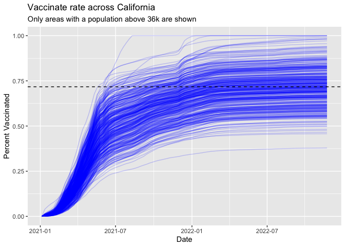

Class17
================
Yuting Shen

``` r
vax <- read.csv("covid19vaccinesbyzipcode_test.csv")
head(vax)
```

      as_of_date zip_code_tabulation_area local_health_jurisdiction          county
    1 2021-01-05                    92240                 Riverside       Riverside
    2 2021-01-05                    91302               Los Angeles     Los Angeles
    3 2021-01-05                    93420           San Luis Obispo San Luis Obispo
    4 2021-01-05                    91901                 San Diego       San Diego
    5 2021-01-05                    94110             San Francisco   San Francisco
    6 2021-01-05                    91902                 San Diego       San Diego
      vaccine_equity_metric_quartile                 vem_source
    1                              1 Healthy Places Index Score
    2                              4 Healthy Places Index Score
    3                              3 Healthy Places Index Score
    4                              3 Healthy Places Index Score
    5                              4 Healthy Places Index Score
    6                              4 Healthy Places Index Score
      age12_plus_population age5_plus_population tot_population
    1               29270.5                33093          35278
    2               23163.9                25899          26712
    3               26694.9                29253          30740
    4               15549.8                16905          18162
    5               64350.7                68320          72380
    6               16620.7                18026          18896
      persons_fully_vaccinated persons_partially_vaccinated
    1                       NA                           NA
    2                       15                          614
    3                       NA                           NA
    4                       NA                           NA
    5                       17                         1268
    6                       15                          397
      percent_of_population_fully_vaccinated
    1                                     NA
    2                               0.000562
    3                                     NA
    4                                     NA
    5                               0.000235
    6                               0.000794
      percent_of_population_partially_vaccinated
    1                                         NA
    2                                   0.022986
    3                                         NA
    4                                         NA
    5                                   0.017519
    6                                   0.021010
      percent_of_population_with_1_plus_dose booster_recip_count
    1                                     NA                  NA
    2                               0.023548                  NA
    3                                     NA                  NA
    4                                     NA                  NA
    5                               0.017754                  NA
    6                               0.021804                  NA
      bivalent_dose_recip_count eligible_recipient_count
    1                        NA                        2
    2                        NA                       15
    3                        NA                        4
    4                        NA                        8
    5                        NA                       17
    6                        NA                       15
                                                                   redacted
    1 Information redacted in accordance with CA state privacy requirements
    2 Information redacted in accordance with CA state privacy requirements
    3 Information redacted in accordance with CA state privacy requirements
    4 Information redacted in accordance with CA state privacy requirements
    5 Information redacted in accordance with CA state privacy requirements
    6 Information redacted in accordance with CA state privacy requirements

``` r
# vax$as_of_date
```

> Q1. What column details the total number of people fully vaccinated?

persons_fully_vaccinated

> Q2. What column details the Zip code tabulation area?

zip_code_tabulation_area

> Q3. What is the earliest date in this dataset?

2021-01-05

> Q4. What is the latest date in this dataset?

2022-11-22

``` r
skimr::skim(vax)
```

|                                                  |        |
|:-------------------------------------------------|:-------|
| Name                                             | vax    |
| Number of rows                                   | 174636 |
| Number of columns                                | 18     |
| \_\_\_\_\_\_\_\_\_\_\_\_\_\_\_\_\_\_\_\_\_\_\_   |        |
| Column type frequency:                           |        |
| character                                        | 5      |
| numeric                                          | 13     |
| \_\_\_\_\_\_\_\_\_\_\_\_\_\_\_\_\_\_\_\_\_\_\_\_ |        |
| Group variables                                  | None   |

Data summary

**Variable type: character**

| skim_variable             | n_missing | complete_rate | min | max | empty | n_unique | whitespace |
|:--------------------------|----------:|--------------:|----:|----:|------:|---------:|-----------:|
| as_of_date                |         0 |             1 |  10 |  10 |     0 |       99 |          0 |
| local_health_jurisdiction |         0 |             1 |   0 |  15 |   495 |       62 |          0 |
| county                    |         0 |             1 |   0 |  15 |   495 |       59 |          0 |
| vem_source                |         0 |             1 |  15 |  26 |     0 |        3 |          0 |
| redacted                  |         0 |             1 |   2 |  69 |     0 |        2 |          0 |

**Variable type: numeric**

| skim_variable                              | n_missing | complete_rate |     mean |       sd |    p0 |      p25 |      p50 |      p75 |     p100 | hist  |
|:-------------------------------------------|----------:|--------------:|---------:|---------:|------:|---------:|---------:|---------:|---------:|:------|
| zip_code_tabulation_area                   |         0 |          1.00 | 93665.11 |  1817.39 | 90001 | 92257.75 | 93658.50 | 95380.50 |  97635.0 | ▃▅▅▇▁ |
| vaccine_equity_metric_quartile             |      8613 |          0.95 |     2.44 |     1.11 |     1 |     1.00 |     2.00 |     3.00 |      4.0 | ▇▇▁▇▇ |
| age12_plus_population                      |         0 |          1.00 | 18895.04 | 18993.88 |     0 |  1346.95 | 13685.10 | 31756.12 |  88556.7 | ▇▃▂▁▁ |
| age5_plus_population                       |         0 |          1.00 | 20875.24 | 21105.98 |     0 |  1460.50 | 15364.00 | 34877.00 | 101902.0 | ▇▃▂▁▁ |
| tot_population                             |      8514 |          0.95 | 23372.77 | 22628.51 |    12 |  2126.00 | 18714.00 | 38168.00 | 111165.0 | ▇▅▂▁▁ |
| persons_fully_vaccinated                   |     14921 |          0.91 | 13466.34 | 14722.46 |    11 |   883.00 |  8024.00 | 22529.00 |  87186.0 | ▇▃▁▁▁ |
| persons_partially_vaccinated               |     14921 |          0.91 |  1707.50 |  1998.80 |    11 |   167.00 |  1194.00 |  2547.00 |  39204.0 | ▇▁▁▁▁ |
| percent_of_population_fully_vaccinated     |     18665 |          0.89 |     0.55 |     0.25 |     0 |     0.39 |     0.59 |     0.73 |      1.0 | ▃▃▆▇▃ |
| percent_of_population_partially_vaccinated |     18665 |          0.89 |     0.08 |     0.09 |     0 |     0.05 |     0.06 |     0.08 |      1.0 | ▇▁▁▁▁ |
| percent_of_population_with_1\_plus_dose    |     19562 |          0.89 |     0.61 |     0.25 |     0 |     0.46 |     0.65 |     0.79 |      1.0 | ▂▂▆▇▆ |
| booster_recip_count                        |     70421 |          0.60 |  5655.17 |  6867.49 |    11 |   280.00 |  2575.00 |  9421.00 |  58304.0 | ▇▂▁▁▁ |
| bivalent_dose_recip_count                  |    156958 |          0.10 |  1646.02 |  2161.84 |    11 |   109.00 |   719.00 |  2443.00 |  18109.0 | ▇▁▁▁▁ |
| eligible_recipient_count                   |         0 |          1.00 | 12309.19 | 14555.83 |     0 |   466.00 |  5810.00 | 21140.00 |  86696.0 | ▇▂▁▁▁ |

> Q5. How many numeric columns are in this dataset?

13

> Q6. Note that there are “missing values” in the dataset. How many NA
> values there in the persons_fully_vaccinated column?

14921

``` r
sum( is.na(vax$persons_fully_vaccinated) )
```

    [1] 14921

> Q7. What percent of persons_fully_vaccinated values are missing (to 2
> significant figures)?

8.5 percent

``` r
(1-0.9145594)*100
```

    [1] 8.54406

> Q8. \[Optional\]: Why might this data be missing?

It could be they don’t have the system to track everyone’s record in
collectinng all data.

``` r
library(lubridate)
```

    Loading required package: timechange


    Attaching package: 'lubridate'

    The following objects are masked from 'package:base':

        date, intersect, setdiff, union

``` r
today()
```

    [1] "2022-12-01"

``` r
vax$as_of_date <- ymd(vax$as_of_date)
```

> Q9. How many days have passed since the last update of the dataset?

6 days

``` r
today() - vax$as_of_date[174636]
```

    Time difference of 9 days

``` r
vax$as_of_date[nrow(vax)] - vax$as_of_date[1]
```

    Time difference of 686 days

> Q10. How many unique dates are in the dataset (i.e. how many different
> dates are detailed)?

99 unique dates

``` r
library(dplyr)
```


    Attaching package: 'dplyr'

    The following objects are masked from 'package:stats':

        filter, lag

    The following objects are masked from 'package:base':

        intersect, setdiff, setequal, union

``` r
vax %>% 
  group_by(as_of_date)%>%
  summarise()
```

    # A tibble: 99 × 1
       as_of_date
       <date>    
     1 2021-01-05
     2 2021-01-12
     3 2021-01-19
     4 2021-01-26
     5 2021-02-02
     6 2021-02-09
     7 2021-02-16
     8 2021-02-23
     9 2021-03-02
    10 2021-03-09
    # … with 89 more rows

## Working with ZIP codes

``` r
library(zipcodeR)
```

``` r
geocode_zip('92037')
```

    # A tibble: 1 × 3
      zipcode   lat   lng
      <chr>   <dbl> <dbl>
    1 92037    32.8 -117.

``` r
zip_distance('92037','92109')
```

      zipcode_a zipcode_b distance
    1     92037     92109     2.33

``` r
reverse_zipcode(c('92037', "92109") )
```

    # A tibble: 2 × 24
      zipcode zipcode_…¹ major…² post_…³ common_c…⁴ county state   lat   lng timez…⁵
      <chr>   <chr>      <chr>   <chr>       <blob> <chr>  <chr> <dbl> <dbl> <chr>  
    1 92037   Standard   La Jol… La Jol… <raw 20 B> San D… CA     32.8 -117. Pacific
    2 92109   Standard   San Di… San Di… <raw 21 B> San D… CA     32.8 -117. Pacific
    # … with 14 more variables: radius_in_miles <dbl>, area_code_list <blob>,
    #   population <int>, population_density <dbl>, land_area_in_sqmi <dbl>,
    #   water_area_in_sqmi <dbl>, housing_units <int>,
    #   occupied_housing_units <int>, median_home_value <int>,
    #   median_household_income <int>, bounds_west <dbl>, bounds_east <dbl>,
    #   bounds_north <dbl>, bounds_south <dbl>, and abbreviated variable names
    #   ¹​zipcode_type, ²​major_city, ³​post_office_city, ⁴​common_city_list, …

## Focus on the San Diego area

``` r
# Subset to San Diego county only areas
library(dplyr)

sd <- filter(vax, county == "San Diego")
nrow(sd)
```

    [1] 10593

> Q11. How many distinct zip codes are listed for San Diego County?

107

``` r
sd %>% 
  group_by(zip_code_tabulation_area)%>%
  summarise()
```

    # A tibble: 107 × 1
       zip_code_tabulation_area
                          <int>
     1                    91901
     2                    91902
     3                    91905
     4                    91906
     5                    91910
     6                    91911
     7                    91913
     8                    91914
     9                    91915
    10                    91916
    # … with 97 more rows

``` r
sd.10 <- filter(vax, county == "San Diego" &
                age5_plus_population > 10000)
```

> Q12. What San Diego County Zip code area has the largest 12 +
> Population in this dataset?

Zip code: 92154

``` r
which.max(sd$age12_plus_population)
```

    [1] 53

``` r
sd[53,]
```

       as_of_date zip_code_tabulation_area local_health_jurisdiction    county
    53 2021-01-05                    92154                 San Diego San Diego
       vaccine_equity_metric_quartile                 vem_source
    53                              2 Healthy Places Index Score
       age12_plus_population age5_plus_population tot_population
    53               76365.2                82971          88979
       persons_fully_vaccinated persons_partially_vaccinated
    53                       17                         1379
       percent_of_population_fully_vaccinated
    53                               0.000191
       percent_of_population_partially_vaccinated
    53                                   0.015498
       percent_of_population_with_1_plus_dose booster_recip_count
    53                               0.015689                  NA
       bivalent_dose_recip_count eligible_recipient_count
    53                        NA                       17
                                                                    redacted
    53 Information redacted in accordance with CA state privacy requirements

> Q13. What is the overall average “Percent of Population Fully
> Vaccinated” value for all San Diego “County” as of “2022-11-15”?

``` r
df_22.11.15 <- sd %>% 
  filter(as_of_date=="2022-11-15")
# df_22.11.15
df_22.11.15_clean<- df_22.11.15%>% 
  filter(!is.na(percent_of_population_fully_vaccinated))
# df_22.11.15_clean
```

``` r
mean(df_22.11.15_clean$percent_of_population_fully_vaccinated)
```

    [1] 0.7369099

> Q14. Using either ggplot or base R graphics make a summary figure that
> shows the distribution of Percent of Population Fully Vaccinated
> values as of “2022-11-15”?

``` r
library(ggplot2)

ggplot(df_22.11.15_clean) +
  aes(x=percent_of_population_fully_vaccinated) +
  geom_histogram(bins = 18) +
  xlim(c(0,1))+
  labs(title="Historgram of Vaccination Rates Across San Diego County", x="Percent of Population Fully Vaccinated in a Zip Code Area", y="Count(Zip code areas", subtitle="As of 2022-11-15") 
```

    Warning: Removed 2 rows containing missing values (`geom_bar()`).


## Focus on UCSD/La Jolla

``` r
ucsd <- filter(sd, zip_code_tabulation_area=="92037")
# ucsd
ucsd[1,]$age5_plus_population
```

    [1] 36144

> Q15. Using ggplot make a graph of the vaccination rate time course for
> the 92037 ZIP code area:

``` r
ggplot(ucsd) +
  aes(x=as_of_date,
      y=ucsd$percent_of_population_fully_vaccinated) +
  geom_point() +
  geom_line(group=1) +
  ylim(c(0,1)) +
  labs(title="Vaccination rate for La Jolla CA 92037", x="Date", y="Percent Vaccinated")
```

    Warning: Use of `ucsd$percent_of_population_fully_vaccinated` is discouraged.
    ℹ Use `percent_of_population_fully_vaccinated` instead.
    Use of `ucsd$percent_of_population_fully_vaccinated` is discouraged.
    ℹ Use `percent_of_population_fully_vaccinated` instead.


## Comparing to similar sized areas

``` r
# Subset to all CA areas with a population as large as 92037
vax.36 <- filter(vax, age5_plus_population > 36144 &
                as_of_date == "2022-11-15")
# vax.36
#head(vax.36)
```

> Q16. Calculate the mean “Percent of Population Fully Vaccinated” for
> ZIP code areas with a population as large as 92037 (La Jolla)
> as_of_date “2022-11-15”. Add this as a straight horizontal line to
> your plot from above with the geom_hline() function?

``` r
mean(vax.36$percent_of_population_fully_vaccinated)
```

    [1] 0.7172851

``` r
ggplot(ucsd) +
  aes(x=as_of_date,
      y=ucsd$percent_of_population_fully_vaccinated) +
  geom_point() +
  geom_line(group=1) +
  ylim(c(0,1)) +
  labs(title="Vaccination rate for La Jolla CA 92037", x="Date", y="Percent Vaccinated")+
  geom_hline(yintercept = 0.7172851, linetype = 'dashed', col = 'red')
```

    Warning: Use of `ucsd$percent_of_population_fully_vaccinated` is discouraged.
    ℹ Use `percent_of_population_fully_vaccinated` instead.
    Use of `ucsd$percent_of_population_fully_vaccinated` is discouraged.
    ℹ Use `percent_of_population_fully_vaccinated` instead.


> Q17. What is the 6 number summary (Min, 1st Qu., Median, Mean, 3rd
> Qu., and Max) of the “Percent of Population Fully Vaccinated” values
> for ZIP code areas with a population as large as 92037 (La Jolla)
> as_of_date “2022-11-15”?

``` r
summary(vax.36$percent_of_population_fully_vaccinated)
```

       Min. 1st Qu.  Median    Mean 3rd Qu.    Max. 
     0.3785  0.6396  0.7155  0.7173  0.7880  1.0000 

> Q18. Using ggplot generate a histogram of this data.

``` r
ggplot(vax.36) +
  aes(x=percent_of_population_fully_vaccinated) +
  geom_histogram(bins = 18) +
  xlim(c(0,1))+
  labs(x="Percent Vaccinated")
```

    Warning: Removed 2 rows containing missing values (`geom_bar()`).


> Q19. Is the 92109 and 92040 ZIP code areas above or below the average
> value you calculated for all these above?

For 92040, the percent of poluation fully vaccinated is 0.547 which is
below the average value, 0.7173. For 92109, the percent of poluation
fully vaccinated is 0.693 which is below the average value, 0.7173.

``` r
vax %>% filter(as_of_date == "2022-11-15") %>%  
  filter(zip_code_tabulation_area=="92040") %>%
  select(percent_of_population_fully_vaccinated)
```

      percent_of_population_fully_vaccinated
    1                               0.546646

``` r
vax %>% filter(as_of_date == "2022-11-15") %>%  
  filter(zip_code_tabulation_area=="92109") %>%
  select(percent_of_population_fully_vaccinated)
```

      percent_of_population_fully_vaccinated
    1                               0.693299

> Q20. Finally make a time course plot of vaccination progress for all
> areas in the full dataset with a age5_plus_population \> 36144.

``` r
vax.36.all <- filter(vax, age5_plus_population > 36144)


ggplot(vax.36.all) +
  aes(as_of_date,
      percent_of_population_fully_vaccinated, 
      group=zip_code_tabulation_area) +
  geom_line(alpha=0.2, color="blue") +
  ylim(c(0,1)) +
  labs(x="Date", y="Percent Vaccinated",
       title="Vaccinate rate across California",
       subtitle="Only areas with a population above 36k are shown") +
  geom_hline(yintercept = 0.7172851, linetype = 'dashed')
```

    Warning: Removed 184 rows containing missing values (`geom_line()`).



> Q21. How do you feel about traveling for Thanksgiving Break and
> meeting for in-person class afterwards?

I believe that extra precaution should be made aware of by reinforcing
mask use in close environment and testing on a weekly basis.
